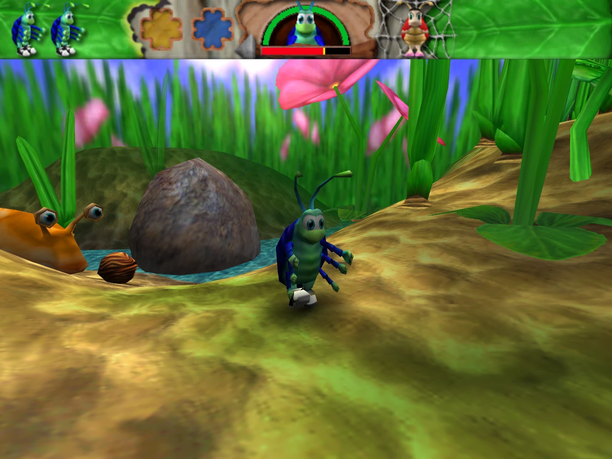

# Bugdom

This is Pangea Software's **Bugdom** updated to run on modern operating systems.
This version, at https://github.com/jorio/bugdom, is approved by Pangea Software.

**Download the game for macOS, Windows and Linux here:** https://github.com/jorio/bugdom/releases

## About this port

Bugdom is a 1999 Macintosh game by Pangea Software. You play as Rollie McFly, a pill bug on a quest to save ladybugs from King Thorax’s iron grip on the Bugdom.

The game was bundled with some Mac models of the era. It is probably the most advanced game that uses QuickDraw 3D. Unfortunately, QuickDraw 3D has not been updated past Mac OS 9, so experiencing the game used to require booting a PowerPC Mac into OS 9 — until this port came out.

After I finished porting [Nanosaur](https://github.com/jorio/Nanosaur), Pangea offered to let me port Bugdom. I was excited to update this gem of a game because it was a childhood favorite of mine.

This port aims to provide the best way to experience Bugdom today. It introduces some modern comforts (such as support for arbitrary resolutions) and fixes some gameplay bugs. The overall experience is intended to be faithful to the spirit of the original game, so modifications to the game’s design are out of the scope of this project.

The first release of this port used a custom fork of [Quesa](https://github.com/jwwalker/Quesa) for rendering. Bugdom has switched to a tailor-made renderer as of version 1.3.1.

## Documentation

- [BUILD.md](BUILD.md) — How to build on macOS, Windows or Linux.
- [CHANGELOG.md](CHANGELOG.md) — Bugdom version history.
- [LICENSE.md](LICENSE.md) — Licensing information (see also below).
- [Instructions.pdf](docs/Instructions.pdf) — Original instruction manual. Int'l versions:
    [DE](docs/Instructions-DE.pdf)
    [EN](docs/Instructions-EN.pdf)
    [FR](docs/Instructions-FR.pdf)
    [IT](docs/Instructions-IT.pdf)
    [JA](docs/Instructions-JA.pdf)
    [SP](docs/Instructions-ES.pdf)
    [SV](docs/Instructions-SV.pdf)
- [CHEATS.md](CHEATS.md) — Cheat codes!
- [COMMANDLINE.md](COMMANDLINE.md) — Advanced command-line switches.

## License

Bugdom is being re-released here (https://github.com/jorio/bugdom) under the [CC BY-NC-SA 4.0](LICENSE.md) license with permission from Pangea Software, Inc.

Bugdom® is a registered trademark of Pangea Software, Inc.

## Credits

- © 1999 Pangea Software, Inc.
- Designed & developed by Brian Greenstone & Toucan Studio, Inc.
- All artwork herein is © Toucan Studio, Inc.
- All music herein is © Mike Beckett.
- This software includes portions © 2020 Iliyas Jorio.

## More Pangea stuff!

Check out my ports of other Pangea classics:
- [Billy Frontier](https://github.com/jorio/BillyFrontier)
- [Bugdom](https://github.com/jorio/Bugdom)
- [Cro-Mag Rally](https://github.com/jorio/CroMagRally)
- [Mighty Mike (Power Pete)](https://github.com/jorio/MightyMike)
- [Nanosaur 1](https://github.com/jorio/Nanosaur)
- [Nanosaur 2](https://github.com/jorio/Nanosaur2)
- [Otto Matic](https://github.com/jorio/OttoMatic)

All ports are provided free of charge! If you’d like to support the development of Pangea game ports, feel free to visit https://jorio.itch.io and name your own price for any of the games there. Much appreciated! 😊
