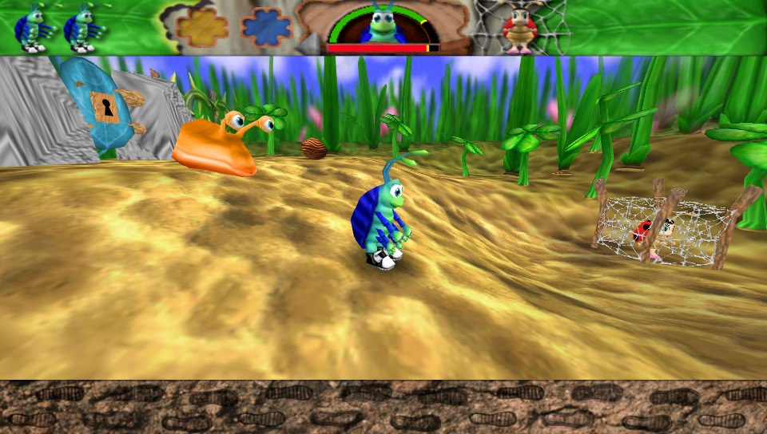

# Bugdom

This is a port of Pangea Software's **Bugdom** to PlayStation Vita, based on the [modern version of Bugdom](https://github.com/jorio/bugdom) written by Iliyas Jorio. For more information on the history of Bugdom and [@jorio](https://github.com/jorio)'s rewrite, see https://github.com/jorio/bugdom.

## Installation

The Vita port uses Rinnegatamante's [VitaGL](https://github.com/Rinnegatamante/vitaGL) library. Therefore, you must first install `libshaccg.suprx`; for instructions see https://samilops2.gitbook.io/vita-troubleshooting-guide/shader-compiler/extract-libshacccg.suprx.

Once you have `libshaccg.suprx`, you can then download and install the Bugdom VPK from the release page.

## Controls and cheats
Controls are the same as they were implemented by [@jorio](https://github.com/jorio); the help (nut) item in the main menu explains them.

Cheats have been given new controls. The following have been implemented:

### In main menu

Hold down `L1` and `R1` and select the START icon to bring up a level select dialog.

### In game

For all in-game cheats, you must simultaneously hold down the left and right shoulder buttons (`L1+R1`) along with a given key.

| Key combo               | What it does                |
|-------------------------|-----------------------------|
| `L1+R1` + `Start`       | win this level              |
| `L1+R1` + `D-pad up`    | get shield                  |
| `L1+R1` + `D-pad right` | full health                 |
| `L1+R1` + `D-pad down`  | full inventory              |
| `L1+R1` + `D-pad left`  | full ball timer             |
| `L1+R1` + `Triangle`    | toggle liquid invincibility |
| `L1+R1` + `Circle`      | display debug statistics    |
| `L1+R1` + `Select`      | hurt player                 |

### Level maps and walkthroughs

Pangea Software's official Bugdom cheat page has maps of the levels:
https://pangeasoft.net/bug/cheats.html

Here's the official strategy guide for the game:
https://pangeasoft.net/bug/strategyguide/index.html

## Notes on Vita Port
### Issues
Overall the port seems to run quite smoothly. The levels are a bit slow to load, typically taking ~15s.

If you notice any bugs (...), please feel free to open an issue.
This is simply a port of [@jorio](https://github.com/jorio)'s excellent work, so new features are beyond the scope of this project (unless they are straightforward and Vita-specific).

### Save files
Games are saved to `ux0:data/Bugdom/`. There are only 3 save slots, but you can back up the files from this directory to effectively have more.

### What's different from upstream
- Controller navigation has been added to all menus and most cheat codes
- Settings have been added to allow reversing camera and flight controls
- A third level of detail has been added between high and low.
- Pixels have been switched from ARGB/BGRA to RGBA

## Documentation

- [BUILD.md](BUILD.md) — How to build Bugdom VPK on Linux
- [CHANGELOG.md](CHANGELOG.md) — Bugdom version history ([@jorio](https://github.com/jorio)).
- [LICENSE.md](LICENSE.md) — Licensing information (see also below).
- [Instructions.pdf](docs/Instructions.pdf) — Original instruction manual. International versions:
    [DE](docs/Instructions-DE.pdf)
    [EN](docs/Instructions-EN.pdf)
    [FR](docs/Instructions-FR.pdf)
    [IT](docs/Instructions-IT.pdf)
    [JA](docs/Instructions-JA.pdf)
    [SP](docs/Instructions-ES.pdf)
    [SV](docs/Instructions-SV.pdf)

## License

Bugdom is being re-released at https://github.com/jorio/bugdom under the [CC BY-NC-SA 4.0](LICENSE.md) license with permission from Pangea Software, Inc. This Vita port therefore has the same license.

Bugdom® is a registered trademark of Pangea Software, Inc.

## Credits

- © 1999 Pangea Software, Inc.
- Designed & developed by Brian Greenstone & Toucan Studio, Inc.
- All artwork herein is © Toucan Studio, Inc.
- All music herein is © Mike Beckett.
- This software includes portions © 2020 Iliyas Jorio.
- The Vita port includes portions © 2022 ywnico.

## Support

If you'd like to support the development of this software, please consider buying the desktop version of Bugdom (or another Pangea game) from Iliyas Jorio at https://jorio.itch.io, or make a contribution to [Rinnegatamante](https://github.com/Rinnegatamante) ([Patreon link](https://patreon.com/Rinnegatamante)), who developed VitaGL and so much more for PS Vita.
